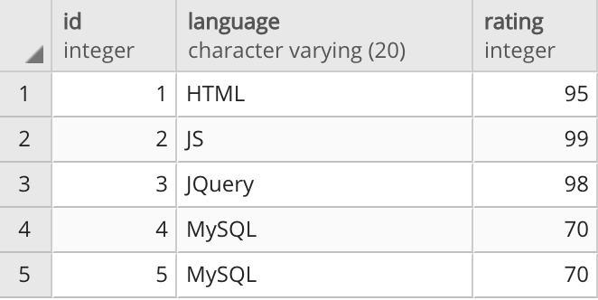

# Making and Using an ID

In this activity, you will recreate a table and then query, insert, and update data.

## Instructions

1. Create a new database named `programming_db`. 

2. Recreate the `programming_languages` table using the following image.

    

    | id integer | language character varying (20) | rating integer |
    |----|----|----|
    | 1 | HTML | 95 |
    | 2 | JS | 99 |
    | 3 | JQuery | 98 |
    | 4 | MySQL | 70 |
    | 5 | MySQL | 70 |

3. Query the table to return the rows containing MySQL, and then delete one of the duplicates.

4. Insert a few more rows of data for additional programming languages by adding the `language` and `rating` of your choice to the `programming_languages` table.

5. Change the name of the JS language to JavaScript.

6. Change the rating for HTML to 90.

## Bonus

* Research how to add columns to a table. Then create a Boolean column named `expert` that has a default value of `true`.

* Start looking into the concept of joins in SQL. (This concept will be covered later in the lesson.)

---

© 2022 Trilogy Education Services, a 2U, Inc. brand. All Rights Reserved.